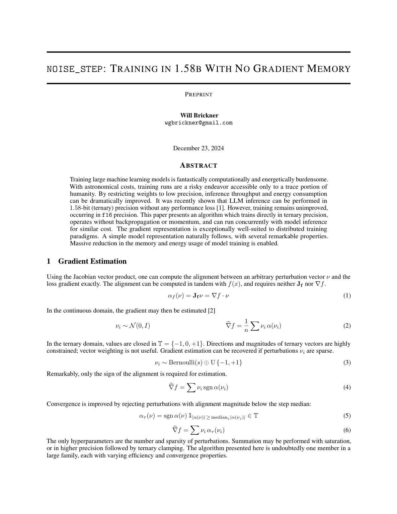

# `noise_step`: Training in 1.58b With No Gradient Memory

<!-- Arxiv wont let me submit (lol) so I am uploading my paper here while I solicit endorsements. -->
<!-- This is a work in progress, but good enough to publish the first draft. -->
<!-- ### [*Endorse me for `cs.lg` so I can post (arxiv.org/auth/endorse?x=7EKSEJ)*](https://arxiv.org/auth/endorse?x=7EKSEJ) -->
---
# **[[COLAB DEMO]](https://colab.research.google.com/drive/1hXzf5xB4INzMUNTlAB8CI1V10-JV7zyg?usp=sharing)**
---
# **[[READ THE PAPER]](./latex/noise_step.pdf)**

